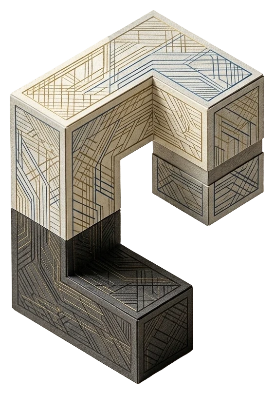

<p align="center">
  
</p>

<h1 align="center">LedgeIndex</h1>

<p align="center">
  Open-core knowledge indexing for developer documentation: crawl, chunk, embed, retrieve, and chat with citations.
</p>

<p align="center">
  <a href="https://ledgeindex.com"></a>
  <a href="https://github.com/ledgeindex/ledgeindex"></a>
  <a href="https://mastra.ai"></a>
  <a href="./LICENSE.md"></a>
</p>

---

## Repository layout

```
ledgeindex/                    # monorepo root (OSS git root when published)
  package.json                   # workspaces: apps/*, packages/*, hosts/*
  tsconfig.base.json
  apps/
    web/                         # @ledgeindex/web — Next.js UI (this was the old ledgeindex/ root)
    docs/                        # @ledgeindex/docs-site — Nextra docs (port 3005)
    desktop/                     # @ledgeindex/desktop — Electron (electron-vite + React)
    mobile/                      # @ledgeindex/mobile — Expo (React Native)
  packages/                      # @ledgeindex/*
  hosts/                         # ag-server, desktop-server, api alias
```

Hosted cloud API entry (if you keep a separate deploy repo) is typically a thin `start` wrapper around `@ledgeindex/server`.
Minimal open-source install: use **`docs`** and **`profile`** profiles (`LEDGEINDEX_PROFILES=docs,profile`). Agents and workflows for AutomationGhost live in **`@ledgeindex/ag`**; **`automationghost-engine`** depends on that package (not the other way around). Use **`hosts/ag-server`** in this monorepo to run docs + profile + ag together. LedgeIndex Electron uses **`hosts/desktop-server`** (docs + profile sidecar).

---

## Prerequisites

- Node.js 20+
- npm workspaces (install from the **workspace root** that lists `ledgeindex` and `ledgeindex-api`)
- At least one LLM / embedding provider
- Optional: Cohere for rerank; local rerank sidecar under `ledgeindex-api/rerank-sidecar/`

---

## Quick start

From the **npm workspace root** (parent directory that contains `ledgeindex/` and `ledgeindex-api/`):

```bash
npm install

# API + Mastra (default :3010)
cp ledgeindex/env.example ../ledgeindex-api/.env
# edit ../ledgeindex-api/.env
npm run dev:ledgeindex-api

# Web UI (default :3004)
npm run dev:ledgeindex
# same as: npm run dev -w @ledgeindex/web

# Docs site (default :3005)
npm run dev:ledgeindex-docs
# same as: npm run dev -w @ledgeindex/docs-site
# or from ledgeindex/: npm run dev:docs
```

Data defaults to `ledgeindex-api/.data/` unless `LEDGEINDEX_DATA_DIR` is set.

- Health: `http://localhost:3010/health`
- Docs: `http://localhost:3005`

---

## Environment

See [`env.example`](./env.example) — copy to `ledgeindex-api/.env`.

| Variable | Purpose |
|----------|---------|
| `LEDGEINDEX_DATA_DIR` | Writable data dir |
| `LEDGEINDEX_PROFILES` | `docs`, `profile` |
| `PORT` / `HOST` | API listen (default `3010`) |
| `GOOGLE_GENERATIVE_AI_API_KEY` / `OPENAI_API_KEY` / `DEEPSEEK_API_KEY` | Models |
| `COHERE_API_KEY` | Rerank (optional) |
| `LEDGEINDEX_VECTOR_BACKEND` | `libsql` or `pgvector` |

---

## Workspace scripts

Run from the npm workspace root:

| Script | Description |
|--------|-------------|
| `dev:ledgeindex-api` | API + Mastra |
| `dev:ledgeindex` | Next.js web UI (:3004) |
| `dev:ledgeindex-docs` | Docs site (:3005) |
| `dev:ledgeindex-desktop` | Electron desktop |
| `typecheck:ledgeindex-packages` | Typecheck `@ledgeindex/*` |
| `test:ledgeindex-core` | Vitest for core |

---

## Packages

| Package | Description |
|---------|-------------|
| `@ledgeindex/core` | Crawl, chunk, vector, query |
| `@ledgeindex/docs` | Ingest, RAG, MCP, routes |
| `@ledgeindex/profile` | Site / entity research profiles |
| `@ledgeindex/server` | `startLedgeIndexServer` |
| `@ledgeindex/client` | HTTP client |
| `@ledgeindex/ag` | Optional AG profile |

---

## Web UI only

```bash
npm run dev -w @ledgeindex/web
```

Set `NEXT_PUBLIC_LEDGEINDEX_API_URL` in `.env.local` if the API is not on the default origin.

---

## Contributing

Run `typecheck:ledgeindex-packages` and `test:ledgeindex-core` before opening a PR.

---

## License

[Sustainable Use License](./LICENSE.md)
